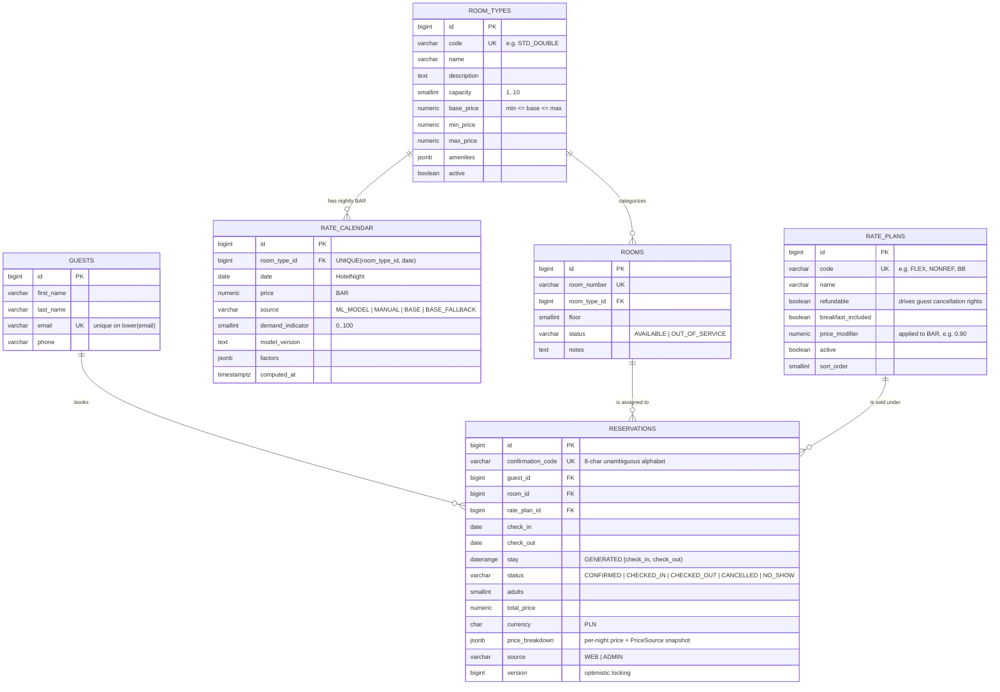

# ERD — `pms` schema

Source of truth: `services/pms-core/src/main/resources/db/migration/V1__baseline.sql`
(Flyway). Update this diagram together with any migration that changes the schema.

Key semantics not expressible in boxes and lines:

- `reservations.stay` is a **generated half-open daterange** `[check_in, check_out)`;
  the `no_double_booking` GiST exclusion constraint forbids overlapping stays on the
  same room for active statuses (`CONFIRMED`, `CHECKED_IN`) — enforced by the
  database even under concurrent requests.
- `rate_calendar.price` is the **BAR** (Best Available Rate) per (room type, night).
  A rate plan's nightly price is derived as `BAR × rate_plans.price_modifier`
  (ADR-0007); the sellable product is a (RoomType, RatePlan) pair.
- `staff_users` participates in no relationships — staff act on data, they are not
  referenced by it (audit trails come later with structured logging).

