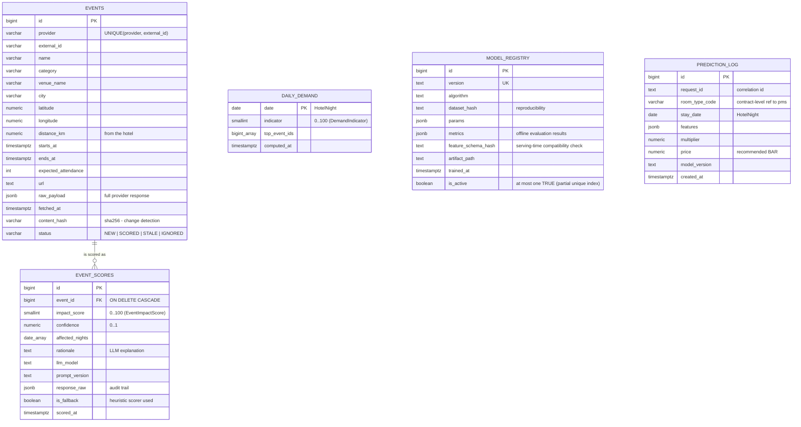

# ERD — `pricing` schema

Source of truth: `services/pricing-service/migrations/versions/0001_baseline.py`
(Alembic). Update this diagram together with any migration that changes the schema.

Key semantics:

- **No foreign keys into the `pms` schema** — the two services share a PostgreSQL
  instance but never couple at the database level (ADR-0002). `room_type_code` in
  `prediction_log` is a contract-level reference, validated by API, not by FK.
- `event_scores` keeps **history** (an event can be re-scored when its content
  changes); the latest `scored_at` per event is the current score.
- `model_registry` enforces **at most one active model** via a partial unique
  index on `is_active WHERE is_active`.
- `daily_demand` is the aggregation seam: many EventImpactScores → one
  DemandIndicator per HotelNight.
- `prediction_log` is append-only; it feeds monitoring dashboards and the thesis
  evaluation statistics.

