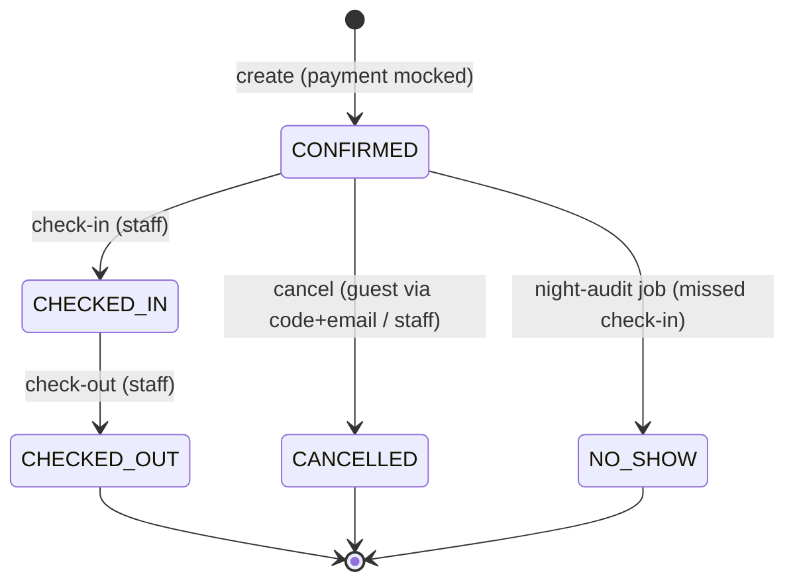

# Reservation state machine

Designed in Phase 1; implemented in the pms-core reservation service (Phase 2,
strict TDD — the tables below are the test specification). A `Reservation` is
always in exactly one status; every transition goes through the service layer
(never raw status updates), is guarded, and is audited via `updated_at` +
structured logs.

## Transitions

| # | Transition | Actor | Guards | Side effects |
|---|------------|-------|--------|--------------|
| T1 | `[*] → CONFIRMED` | Guest (public booking) or staff (admin) | Room of the requested type free for the whole Stay (DB exclusion constraint is the final arbiter); `adults ≤ capacity`; RatePlan active | Concrete room assigned; total price computed from rate calendar (fallback `base_price`) × rate-plan modifier and snapshotted into `price_breakdown`; confirmation code generated; guest deduplicated by email |
| T2 | `CONFIRMED → CHECKED_IN` | Staff | Business date (Europe/Warsaw) ≥ `check_in` and < `check_out` | — |
| T3 | `CONFIRMED → CANCELLED` (guest) | Guest via confirmation code + email | Business date < `check_in`; **RatePlan is refundable** (ADR-0007) | Room released (exclusion constraint only covers active statuses) |
| T4 | `CONFIRMED → CANCELLED` (staff) | Staff | none (staff may always cancel a CONFIRMED reservation) | Room released |
| T5 | `CONFIRMED → NO_SHOW` | Night-audit job (scheduled) | Business date > `check_in` and status still `CONFIRMED` | Room released; WARN logged |
| T6 | `CHECKED_IN → CHECKED_OUT` | Staff | none | Room released |

Terminal states: `CHECKED_OUT`, `CANCELLED`, `NO_SHOW` — no transitions out.

## Illegal-transition matrix (Phase 2 unit-test spec)

Rows = current status, columns = attempted action. ✓ = allowed (guards above),
✗ = rejected with RFC 7807 `409 Conflict` (`illegal-state-transition`).

| From \ Action | check-in | check-out | cancel (guest) | cancel (staff) | no-show (audit) |
|---|---|---|---|---|---|
| `CONFIRMED` | ✓ T2 | ✗ | ✓ T3 | ✓ T4 | ✓ T5 |
| `CHECKED_IN` | ✗ | ✓ T6 | ✗ | ✗ | ✗ |
| `CHECKED_OUT` | ✗ | ✗ | ✗ | ✗ | ✗ |
| `CANCELLED` | ✗ | ✗ | ✗ | ✗ | ✗ |
| `NO_SHOW` | ✗ | ✗ | ✗ | ✗ | ✗ |

## Design notes

- **Why no `PENDING`/payment states:** payment is explicitly mocked (thesis
  scope); a reservation is `CONFIRMED` atomically at creation or not created at
  all. Adding a payment state later is an additive change (new initial state).
- **`NO_SHOW` is job-driven, not query-time:** the night-audit job makes the
  state explicit and auditable instead of deriving "expired" reservations in
  every query; the job run is idempotent (re-running audits the same night
  without duplicating transitions).
- **Concurrency:** two parallel `T1` attempts on the last room are resolved by
  the `no_double_booking` exclusion constraint — the loser receives a domain
  `RoomNoLongerAvailableException` → `409`. Optimistic locking (`version`)
  covers concurrent transitions on the *same* reservation (e.g. guest cancels
  while staff checks in).
- Guest cancellation of a non-refundable reservation is rejected with a
  distinct problem type (`rate-plan-not-refundable`), not a generic 409 — the
  frontend needs to explain *why*.
